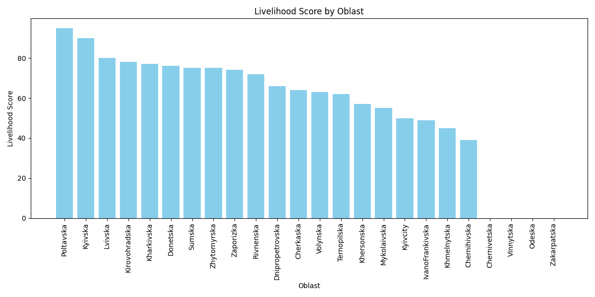

# Python Assignment

## Cleaning dataset assignment.
### Using dataset.csv write python code to do the following:
1. Remove duplicates
2. Replace missing values in livelihood score column with 0
3. Remove unwanted special characters from oblast column values.
4. Order from highest to lowest.
5. Set conditional equation to a new column and call it "Severity". If score is >75 then High, if >49 & <76 then Medium, if <50 then Low
6. Visualize the scores by oblast using bar chart or scatter plot
7. Upload code to your personal github, with readme file that explains the libraries used and the steps applied.
8. Share the respository: suleimanhayek@gmail.com

## Libraries used
1. **pandas**: For data manipulation and analysis, including reading/writing CSV files, data cleaning, and sorting.
2. **numpy**: For numerical computing, including setting conditional values based on specified conditions.
3. **matplotlib.pyplot**: For creating visualizations like bar charts, including setting labels, titles, and customizing plot appearance.

## Code brief explanation
1. `import pandas as pd`: Imports the pandas library and assigns alias 'pd'
2. `import numpy as np`: Imports the numpy library and assigns alias 'np'.
3. `import matplotlib.pyplot as plt`: Imports the pyplot module from the matplotlib library and assigns alias 'plt'.
4. `df = pd.read_csv("resource/Dataset.csv")`: Reads a CSV file into a pandas DataFrame named 'df'.
5. `df = df.drop_duplicates()`: Removes duplicate rows from the DataFrame 'df'.
6. `df['Livelihood_Score'] = df['Livelihood_Score'].fillna(0)`: Fills missing values in the 'Livelihood_Score' column with zeros.
7. `df['Oblast'] = df['Oblast'].str.replace(r"[^a-zA-Z]+", "", regex=True)`: Removes unwanted special characters from the 'Oblast' column values using regular expressions.
8. `df = df.sort_values(by='Livelihood_Score', ascending=False)`: Sorts the DataFrame 'df' based on the 'Livelihood_Score' column in descending order.
9. `conditions = [...]`: Defines conditions based on 'Livelihood_Score' values for creating a new column 'Severity'.
10. `values = [...]`: Defines corresponding values for the 'Severity' column based on the conditions.
11. `df['Severity'] = np.select(conditions, values, default='Unknown')`: Applies the conditions to create the 'Severity' column.
12. `df.to_csv("resource/cleaned_dataset.csv", index=False)`: Writes the cleaned DataFrame to a new CSV file.
13. `plt.figure(figsize=(12, 6))`: Creates a new figure with specified dimensions.
14. `plt.bar(df['Oblast'], df['Livelihood_Score'], color='skyblue')`: Creates a bar chart with 'Oblast' on the x-axis and 'Livelihood_Score' on the y-axis.
15. `plt.xlabel('Oblast')`: Sets the label for the x-axis.
16. `plt.ylabel('Livelihood Score')`: Sets the label for the y-axis.
17. `plt.title('Livelihood Score by Oblast')`: Sets the title for the plot.
18. `plt.xticks(rotation=90)`: Rotates the x-axis labels for better readability.
19. `plt.tight_layout()`: Adjusts subplot parameters to give specified padding.
20. `plt.show()`: Displays the plot.

## Visualized result
